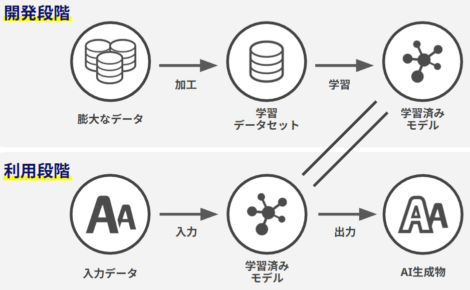
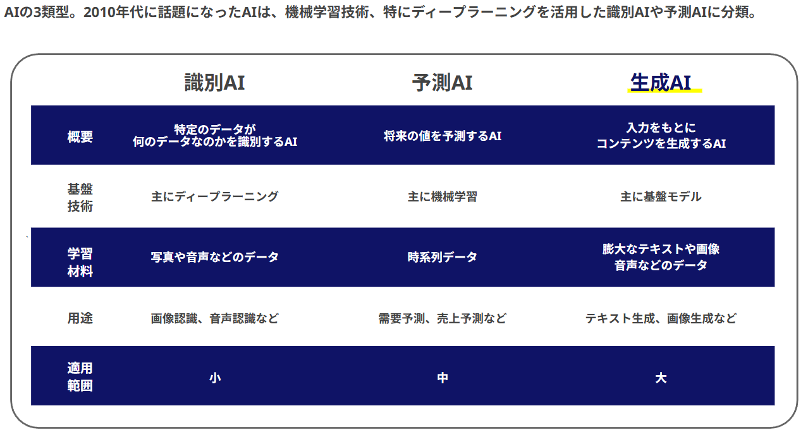

# 生成AIの教科書

## 目次
* 視聴したコンテンツ
* 生成AIとは
  * [AIの定義](#contents1)
  * [生成AIの仕組み](#contents2)
  * [生成AIで出来る事生成AIの仕組み](#contents3)
  * [今までのAIと生成AIの違い](#contents4)
  * [生成AIとの向き合い方](#contents5)
  * [生成AIのリスク](#contents6)
* DXと生成AIの関係性
  * [DX推進におけるマインド](#contents7)
* 生成AI時代のスキル
	* [これから重要になる5つのスキル](#contents8)
* 生成AIの事例
	* [トレンド](#contents9)
	* [導入事例](#contents10)
* [プロンプトエンジニアリング術](#contents11)
	* [プロンプトエンジニアリングとは](#contents12)
	* [4つの構成要素](#contents13)
	* [ハルネーション](#contents14)
	* [プロンプトの5S法則](#contents15)

## 視聴したコンテンツ
* [生成AIの教科書 -ChatGPTの活用法、導入方法、トレンド、事例、DXとの関係まで完全網羅【2025年最新】](https://persolpt-eng.udemy.com/course/ai-ozaken/)
  * [参考資料](https://docs.google.com/presentation/d/1e6o-MO3_str4IhmvsBDoyTnRoIswvkqS_lNfhruOA70/edit?slide=id.g282627aaaf9_0_261#slide=id.g282627aaaf9_0_261)

## 生成AIとは

### AIの定義
AIの定義は決まっていない

### 生成AIの仕組み

### 生成AIで出来る事
生成AIは「対話」じゃなくて「生成」
ChatGPTの存在感の大きさから、生成AIを「対話AI」であると勘違いが多い。

* 画像生成  
テキストを入力すると、入力内容にあった画像を生成してくれる

* テキスト生成  
入力した内容をもとに、新たなテキストを生成する  
特に対話型の生成AIの注目度が高い

* 動画生成  
入力されたテキストを元に動画を背性してくれる  
動画も画像の連続であり、画像生成の延長的な存在

* 音声生成  
音声のデータや入力されたイメージを元に、新たな音声を生成してくれる

### 今までのAIと生成AIの違い

### 生成AIとの向き合い方
生成AIは100点満点を取るツールではなく、  
100点満点のテストで200点、300点を生み出すツール  

既存の問題を解決するだけでなく、  
新しいアイデアや創造的なソリューションを生み出す潜在能力を持っている。

### 生成AIのリスク
* 著作権侵害  
学習データに含まれる著作物に類似したコンテンツを生成する可能性

* 誤情報の拡散  
学習データに含まれる偏見や誤情報をそのまま反映したテキストを生成する可能性

* 悪用  
詐欺やフィッシング詐欺など、様々な犯罪行為に悪用される可能性

* 偏見の助長  
学習データに含まれる偏見をそのまま反映したテキストを生成する可能性

* セキュリティリスク  
サイバー攻撃やマルウェアの拡散に悪用される可能性

* 論理的な問題  
差別的な表現やヘイトスピーチを含むテキストを生成する可能性

## DXと生成AIの関係性

### DX推進におけるマインド
1. 小さく始める  
リスクを軽減、ビジネス的な価値の検証、経験の蓄積のためにもまずは小さな成果を上げる姿勢が大切

1. 生成AI活用、DXを良い方向に導くには、「仮説構築」と「仮説検証」の2つのフェーズに分けて考えることが重要。  
仮説構築：目的設計→仮説  
仮説検証：証明→意思決定

1. 課題を明確化する  
どんな課題を解決したいのかを明確にすることが最も重要

1. 想定データを明確にする  
「仮説」を立証するために必要な結果とデータを明確にし、自社にあるデータと、足りないデータを明確化

1. 方法論にとらわれない  
得た結果を、ビジネスに分かりやすい形で提示し、得られた結果をしっかりとビジネスに活かせるようにする。

## 生成AI時代のスキル

### これから重要になる5つのスキル
* 戦略構築力  
理想像を描き、現状との乖離を把握し、的確な戦略を描く力

* 対人折衝能力  
物事を有利に進められるように、人間関係を調整するスキル

* 論理的思考力  
網羅的に論点整理して考える力。  
困難な事を理解したり、解決したりできる力

* 生成AI活用力  
生成AIを意図した形で活用し、適材適所で活用を進める力

* 問題解決能力  
課題を発見し、原因を特定し、課題が解決する方策を考える力

プランドハップンスタンス理論  
個人のキャリアの8割が偶然の出来事に左右される。  
その偶然を主体的に活用することがキャリアアップにとって重要。  
また、その偶然を意図的に生み出す行動が求められる。

* 好奇心  
新たな物事に興味を持ち、関心のあることや目標だけでなく、知らなかった分野に積極的に関わり、視野を広げる姿勢。

* 持続性  
失敗しても、あきらめることなく、足元を固めながら前進する力。否定されても、自分のキャリアを突き進む力。

* 柔軟性  
変動する社会、環境の中で、自らの在り方を柔軟に変化させ、変化に適応していく対応力。

* 楽観性  
新しいことに取り組む際に、前向きに物事をとらえる力。不必要に落ち込まず、冷静に分析する力。

* 冒険心  
時にはリスクを冒して行動できる正確。新たな挑戦を足場を固めながら、踏み出す勇気。

## 生成AIの事例

### トレンド
社内向け生成AI環境の構築がトレンド  
セキュアな環境で制せAIの活用を進めるために、独自に環境を構築する企業が続発。  
合わせて、社内教育やコミュニティ形成、マニュアルの整備などを通じて、  
一人ひとりの従業員が生成AIを正しく活用できる状態を目指す企業も増えている。

### 導入事例
* 日清食品ホールディングス
  * 概要  
  対話型AI「NISSIN-GPT」をグループ会社3,600人に向け2023年4月25日に公開。  
  現在は営業特化のプロジェクトやRAGの実装なども進行中。

  * ポイント
    * デザイナーを巻き込み、ノーコードで素早く高いUI・UXのサービスをローンチ
    * トップダウンのアプローチで、迅速に、多くの人を巻き込んだプロジェクトに
    * 論理・コンプライアンス教区向け機能を実装
    * レベル別研修でリテラシーレベルを向上
    * 部署に特化した活用で、さらなる活用度アップ

* ベネッセホールディングス
  * 概要  
  Azure OpenAI Serviceを活用した「Benesse Chat」の運用を2023年4月14日から開始。

  * ポイント
    * 社長直下の全社横断DX推進組織がプロジェクトを主導
    * 生成AIをいじってみようという「遊び」を大切にする文化
    * Teamsなどを活用し、社内で生成AIに興味を持つメンバーが集まり、ノウハウを共有
    * すでに生成AIを組み込んだサービスを展開
    * Web制作に特化したプロジェクトを始動

* ディップ
  * 概要  
  全社に250名のアンバサダーを指名。Slackから活用できる環境やNotionを活用したプロンプトデータベースを社内公開。活用度は驚異の80%
  
  * ポイント
    * 生成AIを現場に推進する250名のアンバサダーを指名。現場業務のプロンプト化を推進。
    * Notionを活用して200以上のプロンプトデータベースを構築し、全社社員に公開。
    * Slackの特定のチャンネルで生成AIを解放。気軽にアクセスできるだけでなく、他のメンバーがどんなプロンプトを使用しているのかがわかる。
    * 各部署の要件に応じて、FAQ構築などのプロジェクトを開始

* クレディセゾン
  * 概要  
  2023年11月よりAIアシスタントサービス「SAISON ASSIST」の提供を開始。  
  12月より社内情報回答チャットボット「アシストくん」のテスト運用を開始。
    
  * ポイント
    * 内製で構築した生成AI活用基盤にて、業務知識が必要な問い合わせなども回答可能に。
    * よく利用されるプロンプトはテンプレート化。
    * 内製開発した社内FAQシステムを活用し、Slackで社内情報や業務内容に回答。
    * 生成AIが回答できなかった質問については、自動的に社内FAQに登録される仕組み。
    * 議事録内容を要約するシステムの内製開発に取り組み中。

* アサヒグループホールディングス
  * 概要  
  Azure OpenAI Serviceを活用した「Asahi Chat」の運用を2023年9月から試験導入。
  アサヒグループホールディングス全部門の約300名に展開。
    
  * ポイント
    * Azure OpenAI Serviceを通じてGPT-4にアクセス可能で、セキュリティに考慮。
    * グループ全社に向けて「ChatGPTの利用ガイド」を制定。
    * 全ての機能組織が、当たり前に生成AIスキルとして持つことを目指す。

* LINEヤフー株式会社
  * 概要  
  「Yahoo!検索」において、飲食店名の検索結果に飲食店のクチコミを生成AIが要約した説明文の提供を開始
    
  * ポイント
    * クチコミ自動要約：生成AIが80,000店舗以上の飲食店のクチコミを自動で要約し、説明文として提供。
    * 公式説明文がない店舗にも対応：公式説明文がなくてもクチコミから自動生成された説明文を表示。
    * 利便性向上：ユーザーは店舗の雰囲気やおすすめメニューを簡単に把握可能

* ソフトバンク
  * 概要  
  ソフトバンク版AIチャットを社内向けのサービスとして構築し、全従業員約2万人を対象に2023年5月29日から利用を開始。
    
  * ポイント
    * 安全・安心に業務で活用することを目的に、セキュアな環境で構築
    * 「ソフトバンクAI論理ポリシー」を策定
    * AI論理およびガバナンスに特化した「AIガバナンス基本規定」を策定
    * AI論理に関する教育プログラムを、ソフトバンクの全従業員向けに提供
    * 全ての機能組織が、当たり前に生成AIスキルとして持つことを目指す。

* 伊藤忠
  * 概要  
  「社内版ChatGPT」を4200人に導入開始
    
  * ポイント
    * 資本業務提携関係のブレインパッドと連携
    * 2023年5月に「生成AI研究ラボ」を立ち上げ。
    * 社内で使われるビジネスチャット「Benefitter」のUIを生かして、ChatGPTとAPI連携。
    * 適切なプロンプトを示すマニュアルなども提供。
    * プラグインによる機能拡張も想定。
    * 独自の情報も活用することで、「伊藤忠に特化した生成AI」実現も目指す。

## プロンプトエンジニアリング術
要点  
まずはざっくり指示してみる  
港で話題のプロンプトエンジニアリング術ばかり意識していると  
「生成AI活用は難しい」と思ってしまいがち。  

何を聞いても怒らないので、まずは気軽に生成AIに指示する気軽さを持ちましょう。

### プロンプトエンジニアリングとは
生成AIから望ましい出力を得るために、指示や命令を設計、最適化するスキルの事  

プロンプトは思考回路の言語化である 
普段からいかに論理的にロジックを組み立て、タスクを処理しているのか。  
プロンプトを書く行為は、思考回路の言語化を行う行為と同じである。  

プロンプトはシンプルに！テンプレで！  
ChatGPTなどの生成AIを使っていると、現場業務との接続がとても難しいことに気付くはず。  
だからこそ、シンプルなテンプレート化を意識することが重要。

### 4つの構成要素
プロンプトの基本の構成要素は以下の4つになる
1. 指示  
生成AIに実行してほしいタスク

1. 文脈(目的)  
タスクを依頼する背景情報や目的など

1. 出力形式  
どんな形式でアウトプットが欲しいのかの指示

1. 参照データ  
生成AIが命令を実行する際に必要な参照情報

発展型では、7+1の公式(七里式プロンプト)がオススメ
1. 前提条件  
依頼者や目的などの方向性を指示

1. 対象プロファイル  
対象を設定

1. 参考資料  
参照すべき資料を示す

1. 具体的な行動  
動詞を使って指示

1. 動詞の装飾  
形容詞や副詞で具体性を上げる

1. 出力形式  
回答や結果がどのような形式であるべきか指定

1. スタイルトーン  
使用する言葉のスタイルやトーンを定義

1. 拡張とループ  
再度指示したり、繰り返させることで精度向上

### ハルネーション
ハルネーションとは、生成AIが事実とは異なる情報や存在しない情報を生成してしまう現象

ハルネーションが起こりやすいプロンプトの特徴
1. 架空  
架空の出来事に関する情報を含むプロンプト

1. 時事問題  
変動しやすい時事問題に関する情報

1. マニアック  
オープンになっていないクローズドな情報やマニアックな話題

1. 嘘への出力

### プロンプトの5S法則
1. Scenario  
状況設定：依頼の背景・文脈・役割を提供する

1. Simple  
シンプルに：複雑な表現を避け、シンプルな言葉で伝える

1. Specific  
具体的に：あいまいな表現を避け、具体的な指示を出す

1. Structure  
構造化：情報を整理し、論理的な順序で提示する

1. Sample  
例示：必要な例や追加情報を提供する